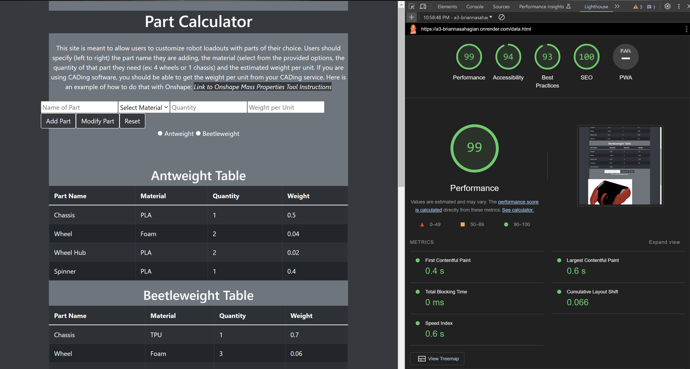
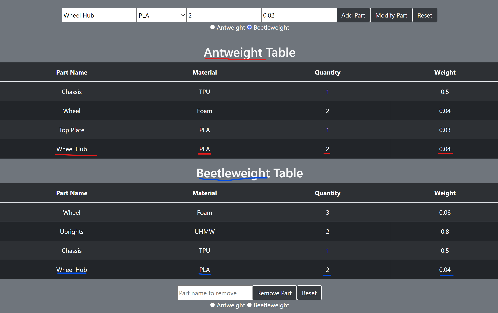
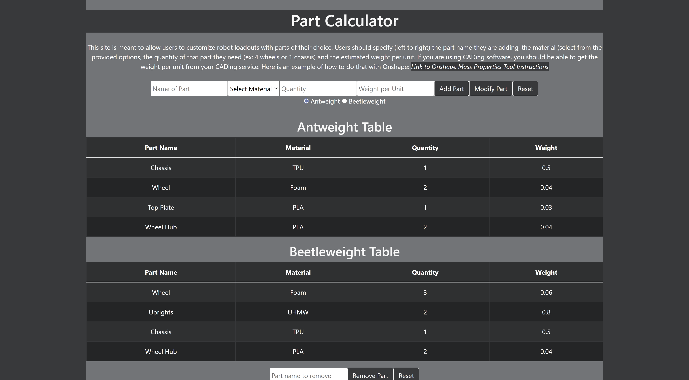
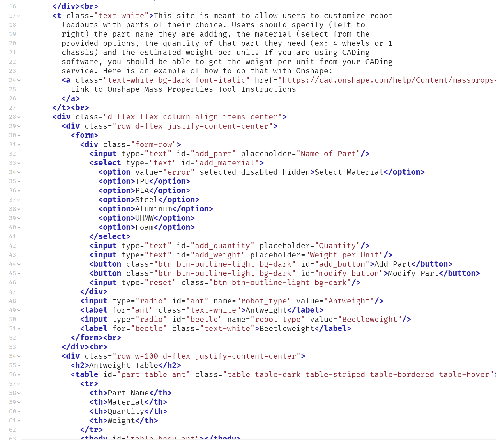

Assignment 3 - Persistence: Two-tier Web Application with Database, Express server, and CSS template
=== 
---

## Part Calculator

Link to my site: https://a3-briannasahagian.onrender.com/  
You can use test login username: trex, password: trocks

The goal of my application is to extend the Part Calculator application I made in A2. I really liked the idea I came up with for the last assignment but was having a lot of trouble with manually styling the CSS. I also think that if I am able to implement this app in a user-friendly manner, people on the combat robotics team may be interested in using it as an organizational tool.

The main challenge I had while developing the application was twofold. First, I really wanted to be able to distinguish between the two classes of robots I was familiar with: Antweight (1lb) and Beetleweight (3lb). In the old version of the application, it was impossible to have two chassis in the table at once, but if the user had two different types of robots they would have two different chassis with different materials and weights. Each builder can only build one Antweight (according to club rules for WPI) and Beetleweights are extremely expensive, so most members only build one. However, these robots can both be built at the same time, since they are of different classes. Thus, I had to find a way to support both classes of robots on my application (this is one of my technical achievements explained in that section). The other challenge was getting the images to display on the page while maintaining a high Lighthouse score. I had to take the screenshots from my own computer, as the images are my own CAD designs. My computer only takes screenshots at 2000x1000 resolution, so I needed to size the images correctly so they [1] didn't lose too much quality and become blurry and [2] didn't cause layout shifting issues.

I chose to use cookies (req.session.login) to authenticate my users because that seemed the easiest to implement since we had an in class example to follow.

I chose to use Bootstrap to develop this application because it is a professional-looking framework that my MQP team used for a very similar type of website: https://wpidlib.github.io/WPID-Library-Docs/index.html. I really like the way that the site came out for that project so I wanted to see if I could make a similar looking page for my application. I was not on front-end for my MQP so this is my first time using Bootstrap. I did not modify the CSS framework, but just took advantage of the provided classes.

I used 'serve-static' to deliver static pages from my views and public folders. This middleware also adds MIME types and auto converts the / URL to ./index.html. I also used 'cookie-session' to enable and use cookies on my application for each user session through the req.session.login variable.  

Here are the Lighthouse results for my pages:

## Technical Achievements
**[1] Hosting Application on a Non-Glitch Service**: I deployed my application on the Render platform. 

Pros
- The auto deployment is pretty cool, though it did not always work for me (or took awhile to actually update onload). I will say, one of my biggest drawbacks on Glitch is the fact that I cannot find an "re-import from Github" option on the assignment I'm working on -- so if I have to re-import because I've made a lot of local changes I have to either copy every single file or import to a completely new project.
- The process to deploy is super intuitive and uploading from Github is quite easy. 

Cons
- Render is extremely slow at deploying, redeploying, and bringing up projects. Glitch is much much faster in comparison.

Overall I honestly like Glitch better, but I'm glad I got to explore another hosting service.

**[2] Filtering Data by Robot Type (Maintaining Two User-Specific Tables)**: I implemented two tables for each user account instead of one to facilitate the condition I specified earlier in the project description.

I did this via the `radio_button` input that allows users to select the type of robot they are adding, modifying, or removing the part to/from. In addition to filtering by username, I also filter by robot_type associated with each collection entry. Thus, a user [1] has to select a robot_type when adding the part or it will not populate one of the rendered tables, [2] has to select a robot_type when deleting a part or the server will not know which part to delete (say there is a scenario where there are two parts with the exact same stats, one in each table -- what should the server do then??), and [3] has to select a robot_type when modifying a part for the same reason as removal. The exact same parts siutation is actually more common than you would think: wheel hubs for Beetleweight robots are not built to add much weight to the robot and are generally in harms way during competition. Based on these criteria, PLA is a good choice for the hub material. Antweight robots are typically only made of PLA because they have to be 3x lighter than Beetleweights. Thus, there could be a scenario with two wheel hub entries with the exact same stats (one entry per robot table).

I believe this technical achievement should be worth +5pts.

### Design/Evaluation Achievements
**[1] Implementing W3C Accessibility Tips**: I followed the following tips from the W3C Web Accessibility Initiative:

(a) `Include alternative text for images`: I swapped one of my images when I switched from A2 to A3 and needed to add a new alt message for this second image. I ended up with the alt text "Image of TRex robot CAD" and "Image of Fracture robot CAD". After updating this alt attribute, I had alterntive text for all of my images, however, I ended up coming back to these attributes later on to make them more accessible. 
(b) `Provide informative, unique page titles`: I adapted the W3C recommended format (specific page • company name) to reflect the project I was creating. Thus, my page titles became "Login Page • Unofficial WPI Combat Robotics Tool" and "Part Calculator • Unofficial WPI Combat Robotics Tool". These titles (especially the part after the dot) makes the purpose of this application extremely clear and meaningful. Maybe if the tool were to get picked up by the team, I would be able to develop an official name for the project...but for now it is a student-developed project and not associated with the actual WPI Combat Robotics Club, which was important to note.  
(c) `Identify page language and language changes`: I made sure to identify the page language as English for ech page using the `<html lang = "en">`  tag. 
(d) `Ensure that interactive elements are easy to identify`: In order to make sure interactive elements were easily identifiable, all of my buttons/submit inputs have consistent styling and change color (darken to black) when a user hovers over them. I had to ensure that this styling was still consistent when I changed my login page button to a 'submit' type input. 

My styling is also very consistent when it comes to form groups (form-row) accross pages, and I include placeholder values for every field (even on the dropdown). I had to play around with select attributes to get the `Select Material` value to show up on the dropdown menu, but I ended up using selected, hidden, and disabled to ensure that once a user clicked the dropdown, they could no longer select the option. 
 
(e) `Write meaningful text alternatives for images`: After exploring this W3C tip, I realized that my alt text was not very descriptive, especially for first time users or users who are not typically in the combat robotics club sphere. I made my alt text more informative for these users to better understand the concepts in the images. 
- New alt for TRex CAD image: "Image of the CAD of an Antweight robot named TRex. 
               An Antweight is a 1lb-limited combat robot mostly made of PLA plastic. 
               A CAD is a Computer-Aided Design, a digital design of the robot that is created before it is built to better visualize how parts fit together."
- New alt for Fracture CAD image: "Image of the CAD of a Beetleweight robot named Fracture. 
               A Beetleweight is a 3lb-limited combat robot usually made of different metals and TPU plastic. 
               A CAD is a Computer-Aided Design, a digital design of the robot that is created before it is built to better visualize how parts fit together." 
(f) `Use headings to convey meaning and structure`: My A2 application had no headings or subheadings, which I realized was not an ideal practice for A3. At first I just added a "Part Calculator" heading for each page and decided that this would be enough to understand the purpose of the site. However, after reading the W3C tips on headings and subheadings, I realized I needed a different header for both of my pages ("Login Page" vs. "Part Calculator"). I also realized I needed subheadings for each part table so that users could distinguish them, so I added those as well ("Antweight Table", "Beetleweight Table"). 
(g) `Use headings and spacing to group related content`: Following the last W3C tip, I decided to ensure that my groupings were distinct enough to separate different elements on the page. My page is organized in a top-down format, and I made sure that there were breaks AND distinct changes in either color or sizing between sections. For instance, between my "Part Calculator" heading and my instructions, I have a dark gray bar to distinguish the sections. Between my add/modify form and my first table I have a large white subheading "Antweight Table". 
(h) `Provide clear instructions`: I made sure my messages for the login screen were informative when each case occurred "New account created successfully!" for first time account creation, "Incorrect login, please re-enter password" for an incorrect password for an existing user. I also added an instructions area for the information needed to properly use the part calculator tool. This section explained what the app was for and explained the information needed for each field. I also added a link with more information about calculating the weight_per_unit field. 
 
(i) `Make link text meaningful`: When I included the link to the Onshape instructions, I made sure to describe it with meaningful text and also made the link stand out on the page. The link directs the user to a guide on how to use Onshape's mass properties tool, which allows them to 'weigh' a part of their CAD. Thus, I described the link with this text: "Link to Onshape Mass Properties Tool Instructions". 
(j) `Don't use color alone to convey information`: My layout style is very consistent for different elements on each page, such that color alone is not used to identify any one type of element. For instance, all of my forms are organized with the form-row class, all of my buttons have the same exact button class styling `"btn btn-outline-light bg-dark"`, both of my tables have the same styling `"table table-dark table-striped table-bordered table-hover"`, and my images are grouped in the same location. This W3C tip is especially noticeable in one of the last elements I added onto my page (the link to Onshape's information page). Instead of using color alone to distinguish the link from the rest of the instructions, the base text color is actually the same. I use the italicized font format plus a dark background to make sure the link stands out. Even without the dark/light contrast of the link background and text, there is still a change in font format (italics) to signal that the text is a link. The link also becomes underlined on hover. 
 
(k) `Provide sufficient contrast between foreground and background`: In order to test this principle, I put my website through a few simulations on a color-blindness visualization tool. Here are some of the results:

From these visualizations of my page through Deuteranopia (1st Image), Protanopia (2nd Image), Tritanopia (3rd Image), and  Monochromacy (4th Image), I determined that the contrast was strong enough that text and interactive elements were still identifiable. There was not too much of a difference aside from a slight tinge of another color/shade between the different filters.  
(l) `Reflect the reading order in the code order`: While I was coding my HTML pages, I made sure to code in the order that the page was laid out. This means that my code order for the data.html page is as follows: page header, instructions, add/modify material form, Antweight table, Beetleweight table, remove form, images. The W3C tip helped me organize my code in a way that it is fairly readable without the tags and in a way that I could easily add new elements to the code by visualizing where they would go on my actual page layout. 
 
